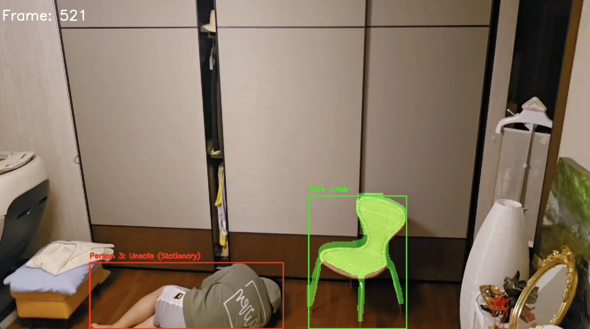

# ElderSafe

# 노인 낙상 감지 모니터링 시스템

본 프로젝트는 영상 내에서 노인의 이동 상태를 모니터링하고, 안전가구(의자, 소파, 침대, 테이블 등)를 세그멘테이션 모델을 통해 인식하여 위험 상황(예: 낙상 등)을 감지하는 시스템입니다. 위험 상황이 감지되면 SMS 알림을 전송하도록 설계되었으며, 단 한 번만 알림이 전송되도록 구현되어 있습니다. 단, SMS 전송 기능은 Twilio 기반으로 구현되어 있으나, Twilio는 유료 서비스이므로 실제 사용 환경에 따라 비활성화하거나 대체 기능을 고려해야 합니다.

## 프로젝트 개요

- **목적:**  
  영상 내에서 사람(특히 노인)의 이동 및 활동을 모니터링하고, 안전가구와의 상대적 위치 및 상호작용을 분석하여 위험 상황(예: 낙상 등)을 신속하게 감지하고 경고를 전송합니다.

- **사용 데이터 및 입력:**   
  - 가구 정보는 안전가구 탐지 모델(YOLOv8x)를 통해 추출됩니다.

- **알고리즘 및 모델:**  
  - **감지 모델:** YOLOv8x-seg (안전가구 인식용)  
  - **감지 모델:** YOLOv8m (사람 감지 및 추적용)  
  - 객체의 이동 경로, 속도, 그리고 세그멘테이션 마스크를 활용하여 위험 상황을 판단합니다.
  
- **연구 배경:**  
  기존의 낙상 감지 기술에 안전가구 인식을 결합하여, 위험 상황을 보다 정확하게 판단할 수 있는 모델을 구현하고자 하였습니다. 관련 연구 및 논문은 추후 구체적인 참고 자료를 업데이트할 예정입니다.

## 설치 및 사용법

### 필수 라이브러리 및 패키지

- Python 3.7 이상
- [OpenCV](https://pypi.org/project/opencv-python/)
- [PyTorch](https://pytorch.org/)
- [ultralytics](https://github.com/ultralytics/ultralytics)
- [numpy](https://pypi.org/project/numpy/)
- [Twilio](https://pypi.org/project/twilio/) (SMS 전송 기능; 유료 서비스)

[//]: # (### )

### 실행 예제 및 테스트 방법

1. **모델 파일 준비:**
   - [yolov8x-seg.pt](https://docs.ultralytics.com/ko/tasks/segment/#models): 안전가구 세그멘테이션 모델
   - [yolov8m.pt](https://docs.ultralytics.com/ko/tasks/detect/): 사람 감지 모델

2. **모델 파일 경로:**
   - `/models/yolov8x-seg.pt`: 안전가구 세그멘테이션 모델  
   - `/models/yolov8m.pt`: 사람 감지 모델  
   파일 경로는 코드 내에서 필요에 따라 수정 가능합니다.

3. **SMS 알림 기능 설정 (선택 사항):**  
   - `/credentials/account_sid.txt`와 `/credentials/auth_token.txt` 파일에 Twilio 계정 SID와 인증 토큰을 입력합니다.  
   - **주의:** SMS 전송 기능은 유료 서비스인 Twilio를 기반으로 하므로, 무료 환경에서는 해당 기능을 비활성화하거나 대체할 필요가 있습니다.

4. **입력 비디오 파일 준비:**
   - [시나리오 동영상 파일](https://drive.google.com/file/d/14d90cJdAhtVTQs-mNNIeRZCxFy63y1u6/view?usp=drive_link): 3개의 시나리오 테스트 영상
   

5. **입력 및 출력 비디오 경로 설정:**  
   - 입력 비디오 경로: `/test-video/input/`  
   - 출력 비디오 경로: `/test-video/output/`  
   경로는 사용 환경에 맞게 수정하세요.

6. **프로그램 실행:**
   실행 후, 지정한 출력 경로에 처리된 비디오가 저장됩니다.

## 논문 및 참고 자료

- 본 프로젝트는 기존 낙상 감지 기술과 안전가구 인식을 결합한 연구를 기반으로 개발되었습니다.
- 관련 논문 및 참고 자료:
  - **논문 제목:** *노인 낙상사고 감지를 위한 모니터링 시스템 개발*
  - **저자 및 연도:** 김동욱, 강신후 2025

[//]: # (  - **참고 링크:** [DOI: 10.xxxx/xxxxxx]&#40;https://doi.org/10.xxxx/xxxxxx&#41;)

## 기여 방법

- **이슈 제보:** 버그 수정이나 개선 사항은 GitHub 이슈 트래커를 통해 제출해 주세요.

## 버전 정보

- **현재 버전:** 1.0.0  

[//]: # (- **변경 내역:** 주요 기능 추가 및 SMS 알림 한 번 전송 로직, 안전가구 인식 세그멘테이션 모델 적용 등은 커밋 메시지와 릴리즈 노트에 기록되어 있습니다.)

## 연락처

- 프로젝트 관리자: 김동욱
- **이메일:** dong5478@korea.ac.kr  
- 추가 문의 사항은 GitHub 리포지토리의 이슈 트래커를 통해 문의해 주세요.

